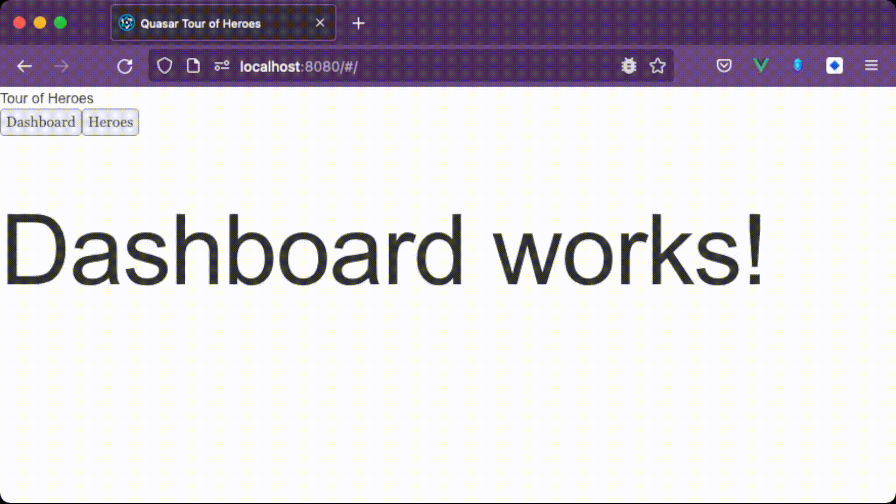

This article will set up the layout and will add the different pages of the Tour of Heroes application. The starting situation is a new Quasar project. The final situation is a Quasar project where the layout is set up and pages have been added.

The code can be obtained by downloading a `zip` of the `Source code`.

Begin situation: [Source code](https://github.com/code-coaching/quasar-tour-of-heroes/releases/tag/Begin)

Final situation: [Source code](https://github.com/code-coaching/quasar-tour-of-heroes/releases/tag/quasar-toh-layouts-and-pages)

## Layouts and pages

Within Quasar, they talk about Layouts and Pages. In fact there is no difference, they are both Vue components. So why the distinction? This is to make a clear distinction between a component that contains elements that should be visible on every page and components that are specific to a page.

A layout is a component that adds elements that should be visible on every page. For example, a header, footer, navigation, etc. The layout also provides an element in which the content of another page will be displayed.

A page is a component in which elements are added that are specific to a page. For example, a list of blog posts, one specific blog post, etc.

## Identify the layout

The result worked towards through several articles:


The image below shows the navigation diagram, which shows the different pages. The arrows indicate which button points to which page. For example, clicking on the button with `View Details` will cause the page with the details of the selected hero to be shown.


To determine what the layout is, one can look at what is found on each page. In looking at the navigation diagram above, it can be seen that the top portion (the title and the two buttons) is the same on all pages.


The purpose of this article is to add the layout and get the pages ready, without implementing the content of the pages yet.

## Add the layout

Create a file called `MainLayout.vue` in `src/layouts/`. Add this file manually or use the command below in the root of the project.

```sh
touch src/layouts/MainLayout.vue
```

The content of this file is:

```html
<template>
  <div>Tour of Heroes</div>
  <button>Dashboard</button>
  <button>Heroes</button>
</template>
```

## Add pages and routing

The navigation diagram shows that there are three different pages.

1. `Dashboard`, with the `Top Heroes`.
1. `Heroes`, with `My Heroes` where a list of heros can be seen.
1. `Details`, with the details of a `Hero`.

In order for these pages to be linked to the router, they must first be created. In the `src/pages` folder, the pages are added. Add them manually or use the command below in the root of the project to create the pages.

```sh
touch src/pages/Dashboard.vue && touch src/pages/HeroList.vue
&& touch src/pages/HeroDetails.vue
```

The content of `src/pages/Dashboard.vue`:

```html
<template>
  <h1>Dashboard works!</h1>
</template>
```

The content of `src/pages/HeroList.vue`:

```html
<template>
  <h1>Hero list works!</h1>
</template>
```

The content of `src/pages/HeroDetails.vue`:

```html
<template>
  <h1>Hero details works!</h1>
</template>
```

In order for the pages to be viewed, they must be linked to the router. In the `src/router/routes.ts` the router is configured. This is a list of routes. A route is a URL that can be visited and determines which component/page is shown.

The content of `src/router/routes.ts`:

```js
import { RouteRecordRaw } from "vue-router";

const routes: RouteRecordRaw[] = [
  {
    path: "/",
    component: () => import("layouts/MainLayout.vue"),
    children: [
      { path: "", component: () => import("pages/Dashboard.vue") },
      { path: "heroes", component: () => import("pages/HeroList.vue") },
      { path: "heroes/:id", component: () => import("pages/HeroDetails.vue") },
    ],
  },

  /*
   * English: The path below will capture all routes that are not defined,
   * leave it as last route.
   * Nederlands: Het pad hieronder zal alle routes die niet gedefinieerd zijn opvangen,
   * laat het als laatste route staan.
   */
  {
    path: "/:catchAll(.*)*",
    component: () => import("pages/Error404.vue"),
  },
];

export default routes;
```

Launch the application to know what the result looks like:

```sh
npm run dev
```

The console displays the URL that the application is running on. By default, the URL is `http://localhost:8080`.

Visit the following routes by changing the URL in the address bar:

- `http://localhost:8080/` (Dashboard)
- `http://localhost:8080/heroes` (HeroList)
- `http://localhost:8080/heroes/1` (HeroDetails)

What?! The content of the pages is not shown! This can be fixed by adding one more line to `src/layouts/MainLayout.vue`:

```html
<template>
  <div>Tour of Heroes</div>
  <button>Dashboard</button>
  <button>Heroes</button>

  <router-view></router-view>
</template>
```

`<router-view></router-view>` is new. This is a slot in the layout where the linked component of the router is loaded.

Again, visit the three different routes in the address bar. Now the contents of the pages are shown!

Alle changes: [GitHub](https://github.com/code-coaching/quasar-tour-of-heroes/compare/Begin..f6ae59d0205576193f14158ca7c06ffa59a963f1)

## Add navigation

The idea is not to always manually type the URL into the address bar to view the pages. It would be convenient if buttons could be clicked to navigate between pages.

Step 1: Add a script tag to `src/layouts/MainLayout.vue`. The Composition API and TypeScript are used.

`src/layouts/MainLayout.vue`

```html
<template>
  <div>Tour of Heroes</div>
  <button>Dashboard</button>
  <button>Heroes</button>

  <router-view></router-view>
</template>

<script lang="ts">
  import { defineComponent } from "vue";

  export default defineComponent({
    setup() {
      return {};
    },
  });
</script>
```

Step 2: Import Vue Router.

`src/layouts/MainLayout.vue` - template is not shown, but is still present.

```html
<script lang="ts">
  import { defineComponent } from "vue";
  import { useRouter } from "vue-router";

  export default defineComponent({
    setup() {
      const router = useRouter();

      return {};
    },
  });
</script>
```

Step 3: Add a function to `src/layouts/MainLayout.vue` to handle routing/navigation.

```html
<script lang="ts">
  import { defineComponent } from "vue";
  import { useRouter } from "vue-router";

  export default defineComponent({
    setup() {
      const router = useRouter();

      const navigate = (path: string) => {
        // void router.push('/'); Navigate to Dashboard
        // void router.push('/heroes'); Navigate to HeroList
        void router.push(path);
      };

      return {};
    },
  });
</script>
```

Step 4: Make the function usable in the template by adding it to the return statement. Link it to the click event of the buttons.

```html
<template>
  <div>Tour of Heroes</div>
  <button @click="navigate('/dashboard')">Dashboard</button>
  <button @click="navigate('/heroes')">Heroes</button>

  <router-view></router-view>
</template>

<script lang="ts">
  import { defineComponent } from "vue";
  import { useRouter } from "vue-router";

  export default defineComponent({
    setup() {
      const router = useRouter();

      const navigate = (path: string) => {
        // void router.push('/'); Navigate to Dashboard
        // void router.push('/heroes'); Navigate to HeroList
        void router.push(path);
      };

      return {
        navigate,
      };
    },
  });
</script>
```



All changes: [GitHub](https://github.com/code-coaching/quasar-tour-of-heroes/compare/f6ae59d0205576193f14158ca7c06ffa59a963f1..4303123bee83bf6c5371d17d1edfade769cbd6f5)

## Add styling

Comparing the application in the browser with the navigation diagram, it can be seen that the styling of the title and buttons do not yet match.


Some `container elements` should be added to facilitate styling of the layout and buttons.

Add a style tag to `src/layouts/MainLayout.vue` and link the CSS to the HTML elements:

```html
<template>
  <div class="layout-container">
    <div class="title">Tour of Heroes</div>
    <div class="button-container">
      <button @click="navigate('/')">Dashboard</button>
      <button @click="navigate('/heroes')">Heroes</button>
    </div>

    <router-view></router-view>
  </div>
</template>

<script lang="ts">
  import { defineComponent } from "vue";
  import { useRouter } from "vue-router";

  export default defineComponent({
    setup() {
      const router = useRouter();

      const navigate = (path: string) => {
        // void router.push('/); Navigate to Dashboard
        // void router.push('/heroes'); Navigate to HeroList
        void router.push(path);
      };

      return {
        navigate,
      };
    },
  });
</script>

<style lang="scss" scoped>
  .title {
    font-size: 1.5rem;
    color: grey;
    font-weight: bold;
  }

  .layout-container {
    margin: 2rem;
  }

  .button-container {
    display: flex;
    gap: 0.25rem;
  }

  button {
    background-color: #eeeeee;
    border-radius: 0.25rem;
    font-weight: 500;
    border: none;
    padding: 0.25rem 0.5rem;
    color: #567868;

    &:hover {
      background-color: darken(#eeeeee, 10%);
      color: #0096e8;
      cursor: pointer;
    }
  }
</style>
```

This already looks more like the navigation diagram!


All changes: [GitHub](https://github.com/code-coaching/quasar-tour-of-heroes/compare/4303123bee83bf6c5371d17d1edfade769cbd6f5..56d3d044f64340a52dc24f8c3c817a9e56c6ede7)

## Refactor for easier maintenance

The code works, nice! But it is not easy to maintain the code. The navigation depends on the route defined in the `src/router/routes.ts` file. Suppose the route for the Heroes list suddenly needs to be changed to `/hero-list`. What impact does this have on the code?

The change would have to be carried through in `src/router/routes.ts` and at any location in the code where there is direct navigation to the route. In the code of this article, this is only in `MainLayout.vue`. But suppose the project is already a bit more elaborate, then this could occur in ten locations as well.

To deal with this, we are going to use `named routes`.

`src/router/routes.ts`

```js
// ...
  {
    path: '/',
    component: () => import('layouts/MainLayout.vue'),
    children: [
      {
        name: 'Dashboard', // This is new
        path: '',
        component: () => import('pages/Dashboard.vue')
      },
      {
        name: 'HeroList', // This is new
        path: '/heroes',
        component: () => import('pages/HeroList.vue')
      },
      {
        name: 'HeroDetails', // This is new
        path: '/heroes/:id',
        component: () => import('pages/HeroDetails.vue')
      }
    ],
  },
// ...
```

`src/layouts/MainLayout.vue`

```html
<template>
  <div class="layout-container">
    <div class="title">Tour of Heroes</div>
    <div class="button-container">
      <button @click="navigate('Dashboard')">Dashboard</button>
      <button @click="navigate('HeroList')">Heroes</button>
    </div>

    <router-view></router-view>
  </div>
</template>

<script lang="ts">
  import { defineComponent } from "vue";
  import { useRouter } from "vue-router";

  export default defineComponent({
    setup() {
      const router = useRouter();

      const navigate = (path: string) => {
        // void router.push({ name: 'Dashboard' }); Navigate to Dashboard
        // void router.push({ name: 'HeroList' }); Navigate to HeroList
        void router.push({ name: path });
      };

      return {
        navigate,
      };
    },
  });
</script>

<!-- ... -->
```

Congratulations! The code is now easier to maintain. Suppose the list of heroes should be shown on a different route, for example `/hero-list`, this is possible by just changing the `path` in `src/router/routes.ts`.

The application functionally still does exactly the same. This can be verified by testing the application again in the browser.

There is still room for improvement, not in terms of maintenance, but to avoid bugs caused by typos. Currently `Dashboard` and `HeroList` are added manually at each location where there is reference to this `named route`. The last improvement added in this article is to add an object that contains all `named routes`.

At the top of `src/router/routes.ts` it now says:

```js
export const ROUTE_NAMES = {
  DASHBOARD: "Dashboard",
  HERO_LIST: "HeroList",
  HERO_DETAILS: "HeroDetails",
};
```

`export` because it is going to be used in other files as well.

Change the references to the `named routes` in `src/router/routes.ts`:

```js
import { RouteRecordRaw } from "vue-router";

export const ROUTE_NAMES = {
  DASHBOARD: "Dashboard",
  HERO_LIST: "HeroList",
  HERO_DETAILS: "HeroDetails",
};

const routes: RouteRecordRaw[] = [
  {
    path: "/",
    component: () => import("layouts/MainLayout.vue"),
    children: [
      {
        name: ROUTE_NAMES.DASHBOARD, // This is new
        path: "",
        component: () => import("pages/Dashboard.vue"),
      },
      {
        name: ROUTE_NAMES.HERO_LIST, // This is new
        path: "/heroes",
        component: () => import("pages/HeroList.vue"),
      },
      {
        name: ROUTE_NAMES.HERO_DETAILS, // This is new
        path: "/heroes/:id",
        component: () => import("pages/HeroDetails.vue"),
      },
    ],
  },

  /*
   * English: The path below will capture all routes that are not defined,
   * leave it as last route.
   * Nederlands: Het pad hieronder zal alle routes die niet gedefinieerd zijn opvangen,
   * laat het als laatste route staan.
   */
  {
    path: "/:catchAll(.*)*",
    component: () => import("pages/Error404.vue"),
  },
];

export default routes;
```

Change the references to the `named routes` in `src/layouts/MainLayout.vue`:

```html
<template>
  <div class="layout-container">
    <div class="title">Tour of Heroes</div>
    <div class="button-container">
      <!-- English: Use the ROUTE_NAMES object -->
      <!-- Nederlands: Gebruik het ROUTE_NAMES object -->
      <button @click="navigate(ROUTE_NAMES.DASHBOARD)">Dashboard</button>
      <button @click="navigate(ROUTE_NAMES.HERO_LIST)">Heroes</button>
    </div>

    <router-view></router-view>
  </div>
</template>

<script lang="ts">
  import { defineComponent } from "vue";
  import { useRouter } from "vue-router";
  import { ROUTE_NAMES } from "../router/routes"; // This is new

  export default defineComponent({
    setup() {
      const router = useRouter();

      const navigate = (path: string) => {
        // void router.push({ name: 'Dashboard' }); Navigate to Dashboard
        // void router.push({ name: 'HeroList' }); Navigate to HeroList
        void router.push({ name: path });
      };

      return {
        navigate,

        // English: This is new, this makes the object available in the template
        // Dutch: Dit is nieuw, dit maakt het object beschikbaar in de template
        ROUTE_NAMES,
      };
    },
  });
</script>

<!-- ... -->
```

Again, nothing has changed functionally. The application still does exactly the same thing. This can be verified by testing the application again in the browser.

One more small change. The function `navigate` has a parameter called `path`, but what actually goes into the parameter called `path` is the `name` of the route. Because descriptive variables and functions make for easier to understand code, `path` is changed to `name`.

```js
const navigate = (name: string) => {
  // void router.push({ name: 'Dashboard' }); Navigate to Dashboard
  // void router.push({ name: 'HeroList' }); Navigate to HeroList
  void router.push({ name: name });
};
```

If `key` and `value` have the same name, it is sufficient to use only the `key`. Thus, the code is changed to:

```js
const navigate = (name: string) => {
  // void router.push({ name: 'Dashboard' }); Navigate to Dashboard
  // void router.push({ name: 'HeroList' }); Navigate to HeroList
  void router.push({ name });
};
```

The same can already be seen with the `return statement` of the `setup()` function.

```js
return {
  navigate,
  ROUTE_NAMES,
};
```

Is similar to:

```js
return {
  navigate: navigate,
  ROUTE_NAMES: ROUTE_NAMES,
};
```

All changes: [GitHub](https://github.com/code-coaching/quasar-tour-of-heroes/compare/56d3d044f64340a52dc24f8c3c817a9e56c6ede7..e4c7e2534940826a43dd00b5aee2373659fcb8c7)

## Conclusion

It is okay to get code working and then refactor it to make it easier to maintain in the future. An example from this article is choosing `named routes` instead of `paths`.

It is okay to refactor code to make sure the code is `DRY`. DRY stands for `Don't Repeat Yourself`. Another wording is: make sure there is a single point of failure. This means that changing the code should only be done at one location and only here can the code be broken by a wrong change. An example from this article is the choice to put the `named routes` in an object and use this object everywhere where a reference to a `named route` is needed.

Clear names for both functions and variables help to read and understand code. An example from this article is the choice to change `path` to `name`.
